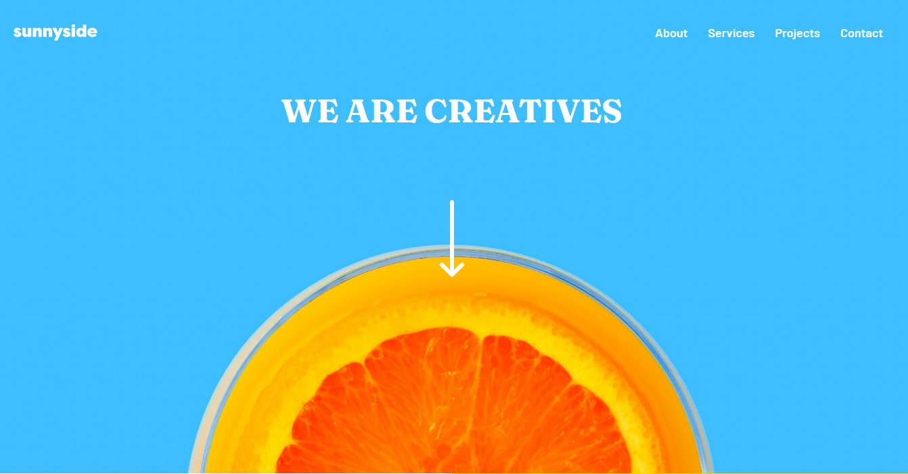

# Frontend Mentor - Sunnyside agency landing page solution

This is a solution to the [Sunnyside agency landing page challenge on Frontend Mentor](https://www.frontendmentor.io/challenges/sunnyside-agency-landing-page-7yVs3B6ef). Frontend Mentor challenges help you improve your coding skills by building realistic projects.

## Table of contents

- [Overview](#overview)
  - [The challenge](#the-challenge)
  - [Screenshot](#screenshot)
  - [Links](#links)
- [My process](#my-process)
  - [Built with](#built-with)
  - [What I learned](#what-i-learned)
  - [Continued development](#continued-development)
- [Author](#author)


## Overview

### The challenge

Users should be able to:

- View the optimal layout for the site depending on their device's screen size
- See hover states for all interactive elements on the page

### Screenshot



### Links

- Solution URL: [https://www.frontendmentor.io/challenges/sunnyside-agency-landing-page-7yVs3B6ef/hub/sunnyside-agency-landing-page-hOUVR6thps]
- Live Site URL: [https://osaode.github.io/Responsive-landing-page-for-an-agency/]

## My process

### Built with

- Semantic HTML5 markup
- CSS3 custom properties
- Flexbox
- Mobile-first workflow
- Javascript

### What I learned

```html
<div class="hero">
        <div class="container">
          <div class="topnav">
            

            <div class="top-links">
              <a href="#">About</a>
              <a href="#">Services</a>
              <a href="#">Projects</a>
              <a href="#">Contact</a>
            </div>

            <div class="hamburger">
              <span class="bar"></span>
              <span class="bar"></span>
              <span class="bar"></span>
            </div>

          </div>

          <p class="pheader">WE ARE CREATIVES</p>
          <div class="himg">
            
          </div>
        </div>
</div>
```

```css
.one-2{
    background-image: url("images/desktop/image-transform.jpg");
    min-height: 600px;
    background-position: center;
    background-repeat: no-repeat;
    background-size: cover;
    position: relative;
    width: 50%;
}
```

```js
hamburger.addEventListener("click", () => {
    hamburger.classList.toggle("active")
    topLinks.classList.toggle("active")
})
```

### Continued development

This project was a nice experience. Going forward I'm going to focus more on improving my javascript and work on my css display properties, knowing when and how to use them.

## Author

- Website - [OSAODE EGHIANRUWA](https://www.github.com/Osaode)
- Frontend Mentor - [@osaode](https://www.frontendmentor.io/profile/osaode)
- Twitter - [@osaode_](https://www.twitter.com/osaode_)

